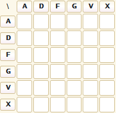
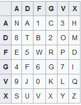

# Writeup xvgfda

by twoface

## Preface

ADFGVX is a classical cipher used long time ago, early 1900s. the logic behind it is simple, it uses [columnar transposition](https://en.wikipedia.org/wiki/Transposition_cipher#Columnar_transposition) to rearrange and reorder the "encrypted" text so it becomes harder to decode. 

ADFGVX uses a fixed length key of length n and rearrange the "encrypted" text into mxn table where `m and n element of Z+`.

```
  1 2 3 ... n
1             // 1st row
2             // 2nd row
3             // 3rd row
...
m             // mth row
```

ADFGVX uses `6x6` table as the alphabet dictionary and can be used with any alphabet (even alphanumeric) which length is valid.




## Decoding the encrypted text

To be able to decode the adfgvx cipher correctly and precisely, we have to know which alphabet system the cipher uses. in this chall, the note hinted `nachtbommenwerper` which was a dutch codeword. the thing is even if we place each alphabet in the correct place, the 6x6 table still has `36-26` empty cell. Notice that ADFGVX cipher originates from ADFGX which is 5x5 table, hence we have to use alphanumerical codeword where each number are inserted before the corresponding alphabet order (e.g 1 == alphabet[0] == A) (see [wiki](https://en.wikipedia.org/wiki/ADFGVX_cipher) regarding the origin or history ).




After that all we have to do is rearrange the "encrypted" into the correct nxm table order. the chall mentioned the key, `logical`. And strangely the chall's name is reversed , it should be `ADFGVX` not `XVGFDA`. turns out, the "encrypted" text are arranged in reverse order. which means,

```rust
O       L        L       I       G       C       A          
GFDXAXV FVAGXAAF AAGXFXA AXXXDVF FGFFAAA XAGGFFA FFDGFDF 
```

we now have to transpose it into column/matrix shape :

```rust
L O G I C A L  key

F G F A X F A  
V F G X A F A
A D F X G D G
G X F X G G X 
X A A D F F F 
A X A V F D X 
A V A F A F A
F
```

decoding the block text by using the -german-alphabet dict above, we get the message

```rust
FG FA XF AV FG XA FA AD FX GD GG XF XG GX XA AD FF FA XA VF DX AV AF AF AF
R  E  V  3  R  S  E  A  D  F  G  V  X  I  S  A  W  E  S  0  M  3  1  1  1
```

> flag : COMPFEST14{REV3RSEADFGVXISAWES0M3111}
