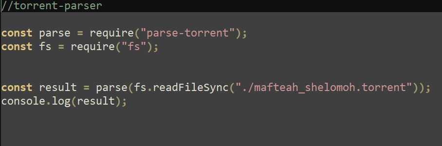
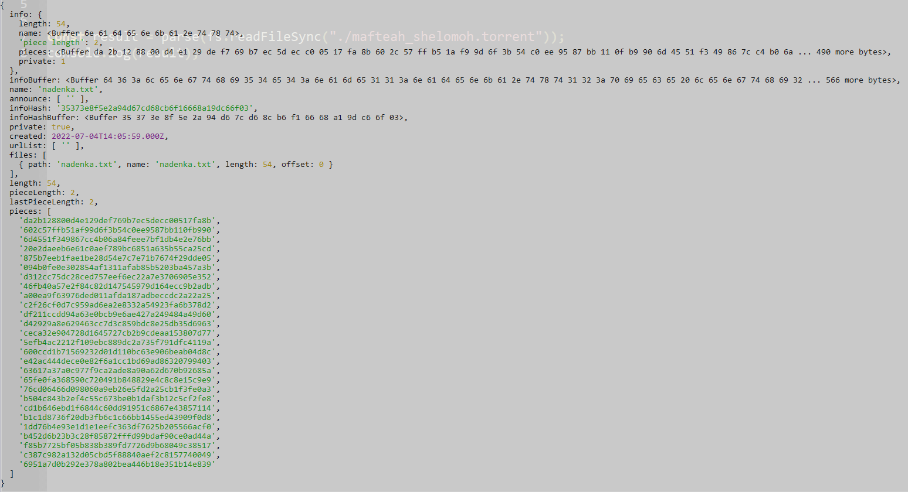
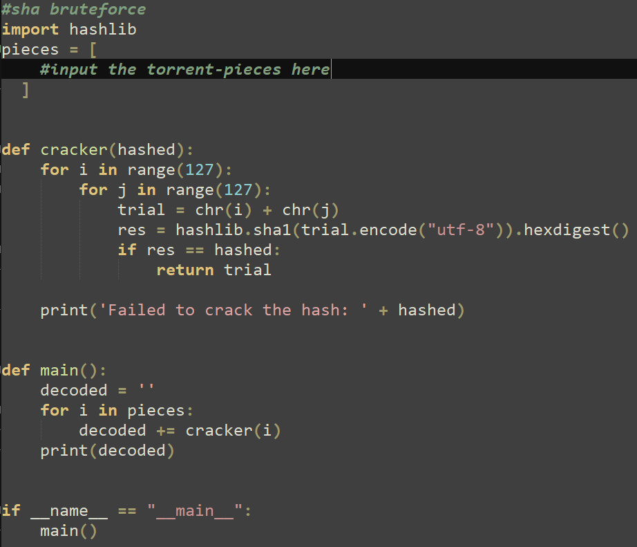
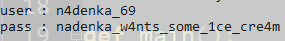

# Writeup seed of s0lomon

## by twoface

## Description 
s0lomon is a land of magik, located off-shore, near `Dale Nation`. every trespasser who steps on S0lomon's soil have to pass the "test" from the s0lomon queen, Nadenka, otherwise they'll be transported to random places. when he went on his pilgrimage, ngab stopped by `s0lomon` land, because he is intrigued by the queen, Nadenka. long short story, ngab met Nadenka and his first impression was this queen is unreasonably cold and harsh, though she is a beauty. For the test, Nadenka says, 
> "*O', trespassers of s0lomon, the seed of s0lomon has been reaped. those who seeks truth, shall parse till the end. if you've found what i want, meet me at dusk and beg for benevolence on the gate of s0lomon. if you choose the wrong gate, punishment shall befall upon you. remember, remember.*".

it was an interesting riddle for ngab, he enjoyed it as if it's his last. just before the dawn arised, ngab successfully solved the riddle and was able to leave s0lomon land with rewards from the queen. "Heh, so that's what the queen wanted. i guess the queen is also a normal human being", said ngab with a big smile. 

## hint
* you might want to check the real data using `torrent-parser`


## solution
You are given a `bittorrent` file and a url that leads you to `s0lomon's gate` web page. on the page, you can find 4 different `login modal inputs`. you can try submitting arbitrary credentials, though you won't get pass the auth page. Now, let's check the given torrent file (you can analyze the file metadata first, or you can try leeching using bittorrent client e.g `bittorent`, `utorrent` ,etc). if we try to leech the torrent using bittorrent client, it won't download anything, nor it connects to any peers. hmm, this is weird. if we analyze the trackers list (again, you can either use the client or any tool), the tracker list seems empty. even if you force-use DHT peering, it still doesn't connect to any peers. it seems we have to analyze the torrent even deeper, and `torrent-parser` would come in handy.


__my torrent-parse script__




__parsed-torrent__


after we parse the torrent, we can see clearly the contents of the torrent file. Now, there are things you have to know regarding torrent. torrent divides file into pieces/chunks of data in which the `piece-length` is equal throughout the entirety, except for the lastpiece (you can read regarding this matter further on google) and torrent stores the `sha1-hashed-pieces` value on the `torrent` so that it can check the validity and integrity of the `entire-file`. now, on the parsed-torrent we can see that the `announce-lists` and `trackers` are set to empty, this explains why we can't connect to any peers. even further we can see the `data-length` and the `piece-length` and the `hashed-pieces` info. Now you know the `piece-length` is 2 bytes which is weird for binary data to be so short and even the `lastpiece-length` is 1 byte (even weirder). recall that an ascii char/code is represented by 8 bit, or 1 byte. aha! it's safe to conclude that this `hashed-pieces`' actual values are just ascii plaintext. we now only have to bruteforce the `sha1` (which is pretty fast) to get the original value every pieces, and append it together. 


__my sha1crack bruteforce script__ (inspired by someone on the internet, i forget who it was)



__cracked-sha1 output__


after cracking the `sha1` we get credentials `user : n4denka_69 pass : nadenka_w4nts_some_1ce_cre4m`. this is the credential used for login.

Back on to the `s0lomon's gate` web, there are many input forms, which one should we choose? (you can choose randomly any form , but that's not the eloquent and correct approach.) recall the description, especially this part "*if you choose the wrong gate, punishment shall befall upon you. remember, remember.*". hmm what does this imply to? well, there's no harm in trying randomly for the first time, let's try from the top one. after you submit there is a popup alert which says `that's not what i want` and there is a cooldown timer for 4 mins. turns out, the web implements rate limitation, so this is what the punishment is. we are stuck, there's no way we try the form 1-by-1 since there is cooldown for each request. 

Now, we can analyze the body request of each http `POST` we sent to the api. aha! we notice 2 peculiar fields on the body, `offering` and `isNight`. judging by the field's name, this must be offering we have to give to Nadenka and we have to make sure the time is at night. recall from the description "*if you've found what i want*" and the password we've found `nadenka_w4nts_some_1ce_cre4m` also notice, there is a dark-mode toggler on right-top of the webpage. this means we only have to choose the form which offers ice cream to nadenka, it is the one with heading `nadenka i'll buy you an ice cream`, and set it to night (darkmode). bam! we are able to login and get the flag.

```
COMPFEST14{n4denk4_l1kes_1ce_cre4m_ea62b43b0e}
```